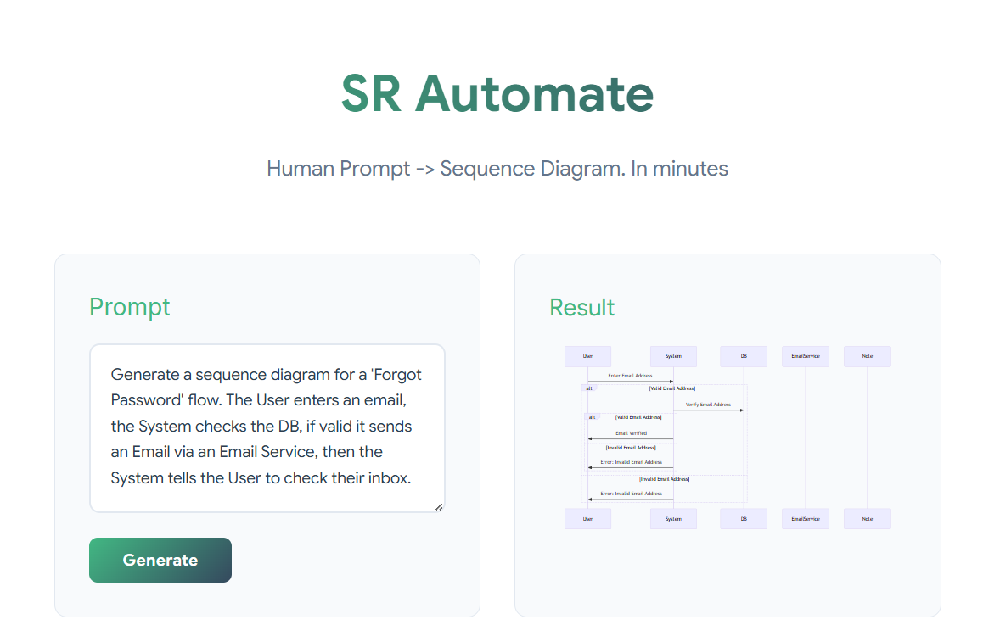

# SR Automate 🚀

**Human Prompt → Sequence Diagram**

SR Automate is an AI-driven tool designed to bridge the gap between abstract software requirements and technical documentation. By leveraging LLMs, it transforms natural language prompts into structured, renderable sequence diagrams.

---

## 🛠️ Tech Stack

| Component | Technology |
| :--- | :--- |
| **Frontend** | Vue 3 (Vite), Tailwind CSS |
| **Backend** | Go (PocketBase) |
| **Database** | PocketBase |
| **LLM** | [Ollama / Gemma3] |
| **Diagrams** | Mermaid.js |


---

## 📂 Project Structure

```text
SR_Automate/
├── backend/             # FastAPI Server & AI Logic
│   ├── app.py           # Main API Entry
│   └── clean.py         # Bytecode cleanup script
├── frontend/            # Vue.js Web App
├── .venv/               # Python Virtual Environment
└── package.json         # Root orchestration

```

## 📚 Documentation
- **Software Requirements**: https://docs.google.com/document/d/1AJgbtDQgTli-4sOeMn2EfwC8PVFq6g-l/edit#heading=h.k2hqyx1pgi0a